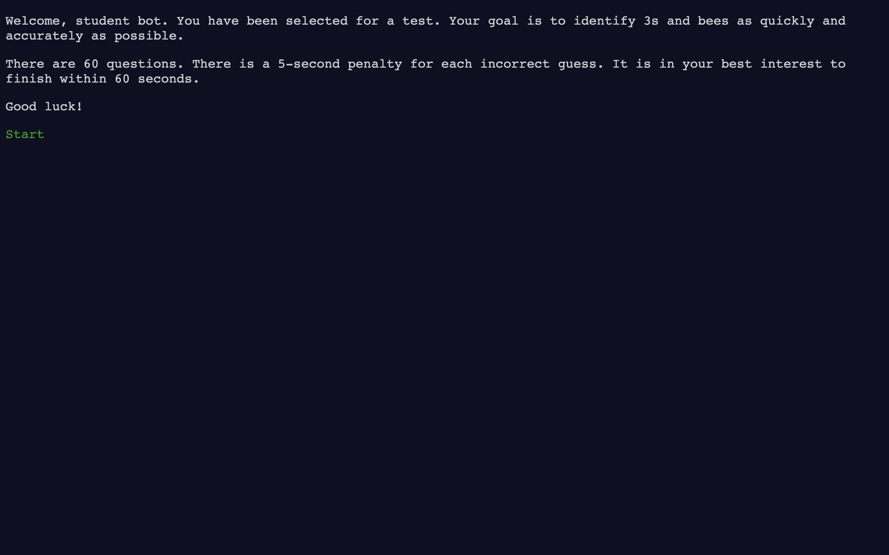
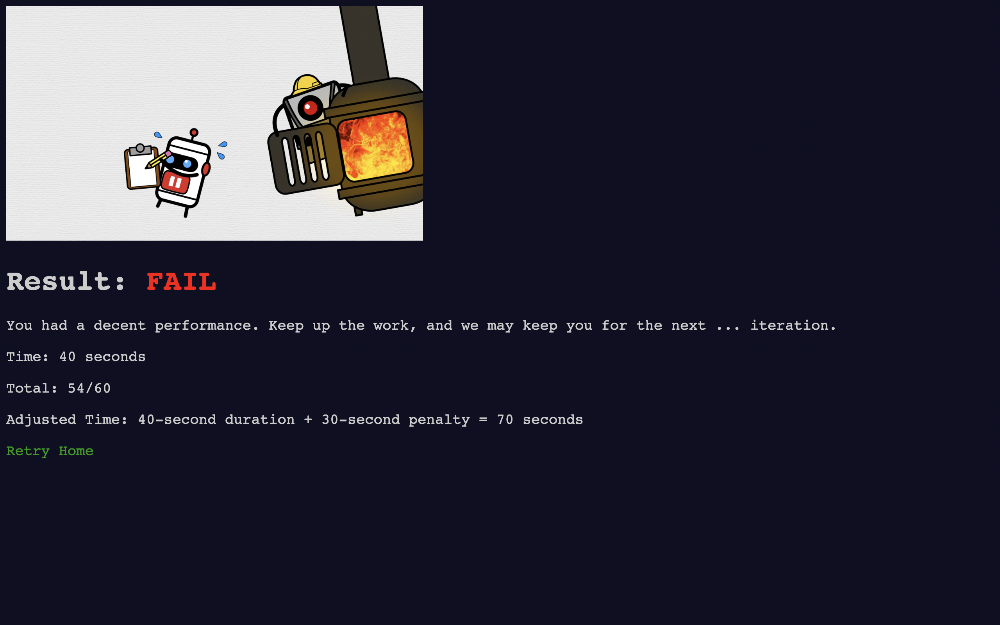

# 3bee
A web application that challenges users to identify 3s and bees as quickly and
accurately as possible.

| Home | Quiz | Result |
| - | - | - |
|  |  |  |

## Installation
Create an environment

`python3 -m venv venv`

Activate the environment

`. venv/bin/activate`

Install Flask

`pip install Flask`

## Usage
Run the application

`flask run`

## Credits
UX inspired by
[How Do Machines Learn?](https://www.cgpgrey.com/blog/how-do-machines-learn)
video by CGP Grey

UI inspired by [Advent of Code](https://adventofcode.com/) design by Eric Wastl
